# 🚀 VPNclient Driver (vpnclient_driver)

Cross-platform VPN client driver leveraging TUN/TAP devices and SOCKS5 protocol for seamless, secure, and performant network communication across Android, iOS, Windows, Linux, and macOS.

## 🏗️ Architecture Overview

```mermaid
sequenceDiagram
    participant App as VPNclient App
    participant Driver as VPNclient Driver
    participant TUN as TUN/TAP
    participant SOCKS as SOCKS5
    
    App->>Driver: Инициализация (SOCKS5 параметры)
    Driver->>TUN: Создание интерфейса
    Driver->>SOCKS: Установка соединения
    loop Работа
        TUN->>Driver: Пакет данных
        Driver->>SOCKS: Пересылка пакета
        SOCKS->>Driver: Ответ
        Driver->>TUN: Запись ответа
    end
```



## Quick Start 🏁

### Clone and Build

```bash
git clone https://github.com/VPNclient/vpnclient_driver.git
cd vpnclient_driver
mkdir build

# Static library
make static

# Shared library
make shared
```

## Contributions 💡
Contributions, issues, and feature requests are welcome! 🌟
